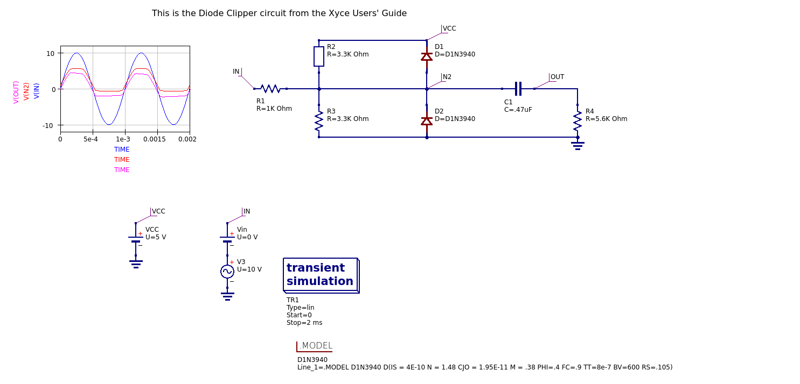

The schematics in this directory are just straightforward
implementations of the Diode Clipper examples from the Xyce Users'
Guide.  We also demonstrate use of native qucs-s graphing of results
and proper use of parameter sweeps.

### DC example demonstrates working around qucs-s bug

As noted in the SuperSimpleDC example, versions of qucs-s at least up
to 0.0.20 have a bug in netlist generation for DC sweeps, which
requires that one set the "Number" parameter in the Parameter Sweep
object one lower than the actual number of points desired.  Here, we
say we want 25 points, with a step size slightly larger than 1, but in
fact what we really want is 26 with a step size of exactly one.  This bug
has been reported to the qucs-s developers.

### Exported schematic image

