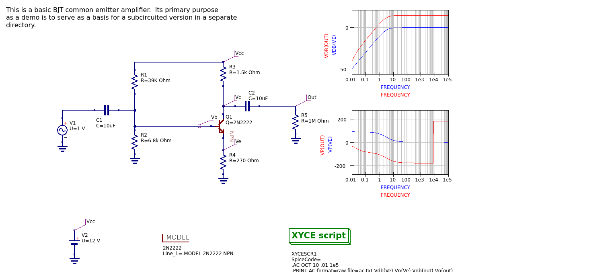

# Simple common emitter circuit

There is not much to see here.  This circuit is just a common-emitter
BJT amplifier, as a straightforward flat circuit.  It really just
serves as a baseline against which to compare the subcircuited version
in the next demo.

The specific circuit in this example is one that was taken from an old
Xyce group application note on how to use Xyce with the open source
schematic capture tool gschem and its associated netlister gnetlist.
At the time that was written qucs-s didn't exist and the team thought
that users might want to use gschem/gnetlist with Xyce, since Xyce has
no schematic capture tool of its own.

When qucs-s gained the ability to run with Xyce, we simply used the
same examples to show how much easier qucs-s is to use than
gschem/gnetlist were.

The original app note can be found in the "documentation and
tutorials" page of the [Xyce web site](https://xyce.sandia.gov).  It
is entitled "Using Open Source Schematic Capture Tools With Xyce" and
was published in 2013.

### Exported schematic image

