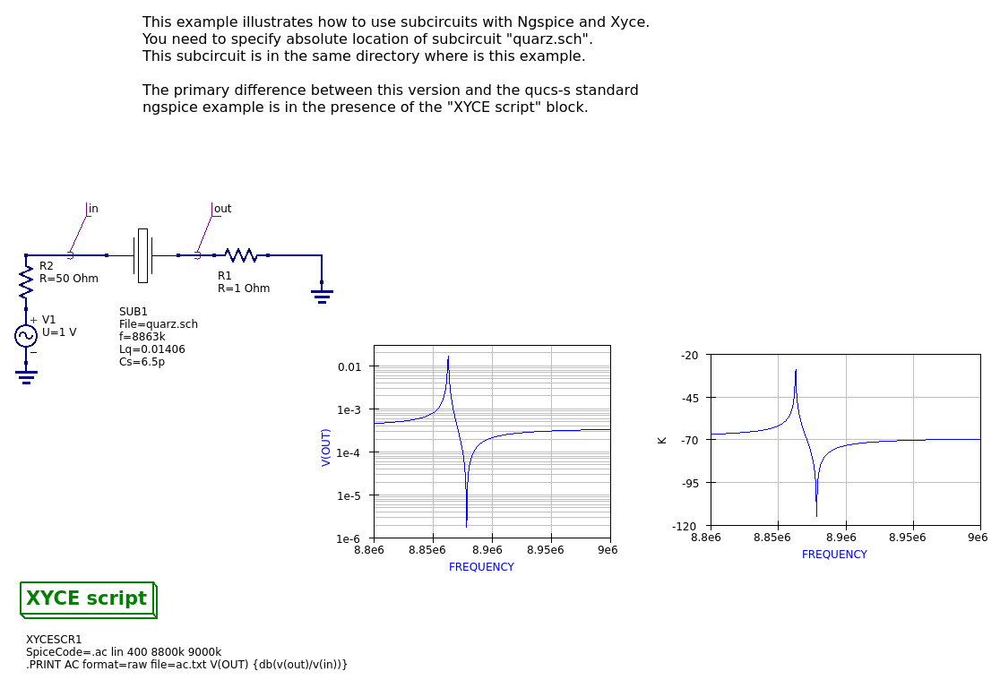

# Quartz crystal filter

The QuartzCrystal circuit is a minor variant of what's in the qucs-s
examples suite (examples/ngspice/quarz.sch) --- that one used
ngspice's ability to do complex arithmetic to compute
db(V(out)/V(in))), which Xyce can't do directly.  But we CAN compute
that function using real equivalents, and this circuit shows how.

Note also that the quarz.sch schematic (the subcircuit) is another
example of a subcircuit schematic where the subcircuit parameters are
defined and given defaults in the subcircuit symbol.  to see this,
open quarz_test.sch, click the crystal symbol, choose the "Go into
subcircuit" option from the right-click menu, and then choose the
"Edit circuit symbol" option from the right-click menu.

### Exported schematic image

