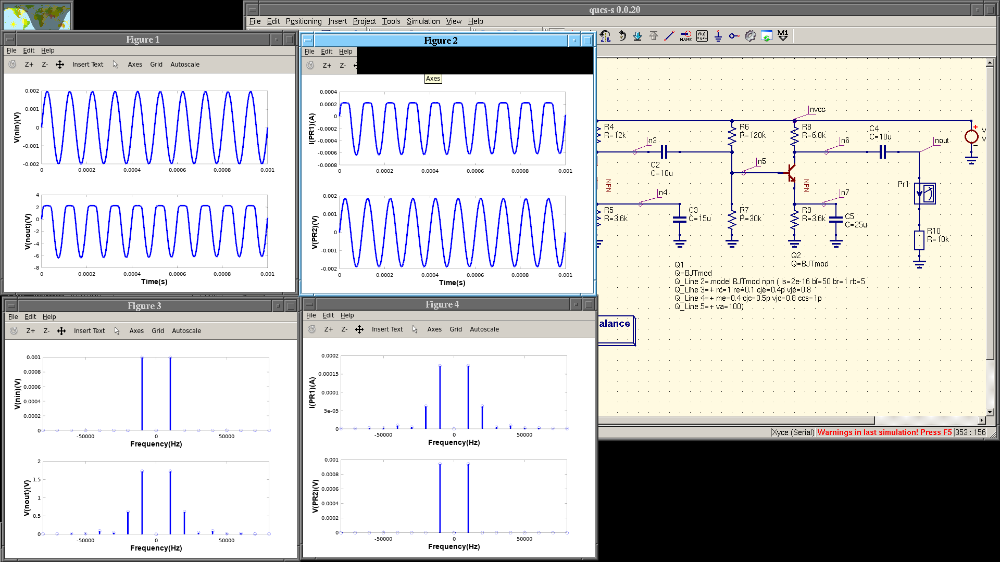

# Demonstration of use of Octave scripting for post-processing

This demo is based on the example in section 6.7.4 of the Qucs-S help
web site at
https://qucs-help.readthedocs.io/en/spice4qucs/PostSim.html.

A two-stage BJT amplifier is driven by a sinusoidal source.  Both a
transient and HB simulation are performed.  The results are plotted by
an Octave script.

This is done by creating a ".m" file with the same base name as the
schematic, in this case "testTwoStageBJT.m".  Then, in the
File->Document Settings... dialog, check the "run script after
simulation" box.  (You will see that testTwoStatgeBJT.m will already
be there in the "Octave Script" box --- qucs-s will put it there
automatically.)

Select "View->Octave Window" in the menu bar, and run the schematic
through Xyce.  Octave will open 4 graph windows.

## Prerequisites: 
To make it work, you must have Octave installed on your system, and
Qucs-s must be able to find it.  In File->Application Settings...,
choose the "Locations" tab and make sure that the "Octave Path" is the
directory name where the Octave executable is installed.

If you start qucs-s in a directory other than the one where this
schematic and its octave scripts reside, then open the schematic using
the "Open" menu option, octave will be started with the current
working directory in the directory where you start qucs-s, and will
therefore be unable to find the scripts.  This always happens if you
are launching qucs-s from a Mac OS X application icon.

To fix the path issue for octave, either start qucs-s in the same
directory where the schematic is stored, launch qucs-s with the "-i"
command line option to load the schematic rather than the "Open"
command, or change octave's working directory before starting the
simulation.  Only the last one is possible when launching qucs-s from
the OS X application icon.  To do this, open the "Octave Window" under
the "View" menu, then "cd" to the directory where scripts live before
starting the simulation.

## Graphs displayed

Time domain data for the V(nin) and V(nout) signals are plotted in
figure 1.

Time domain data for the values of the Pr1 current probe and Pr2
voltage probe are plotted in figure 2.

Frequency domain (HB) data for V(nin) and V(nout) are plotted in
figure 3.

Frequency domain data for the values of the Pr1 current probe and Pr2
voltage probe are plotted in figure 4.

## Differences from Qucs-S help

The example in Qucs-S Help was clearly written a long time ago, and
the script displayed there does not actually work.  It references
functions that do not exist, and even when one substitutes function
names that really are included in the qucs-s install (in
$prefix/share/qucs/octave), the "plotFFT2V" function turns out not to
be written in a way that is correct for the example.  (It takes
time-domain signals and FFTs them before plotting, whereas in the
example on Qucs-S Help, it is being used to plot frequency-domain HB
results).

Further, the "plotCartesian2D2V.m" file provided with Qucs-S defines
the function "PlotCartesian2D2V", not "plotCartesian2D2V".  Octave
complains that the function name does not match the file name.  It was
may have been created on a Mac, where filename case is ignored.

To fix these two issues, I have provided .m files for a copy of
plotCartesian2D2V with the case issue fixed, and a "plotFD2V.m"
function that is a simple modification of plotFFT2V, but which uses an
input vector of frequencies, and plots the data directly without
FFTing it.  They are found by Octave because they are in the same
directory as the testTwoStageBJT.m script.

### Exported schematic image

