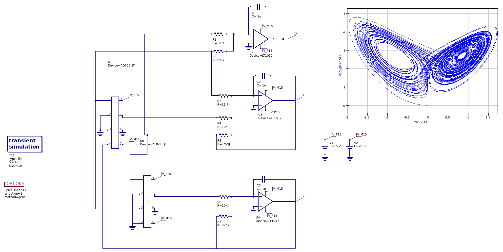

# Lorenz attractor analog computer

This schematic implements the Lorenz "butterfly" attractor circuit
as found here:

http://www.chaotic-circuits.com/10-creating-lorenz-butterfly/

## Value as a demo circuit

This circuit, in addition to just being cool, demonstrates how one can
uses Qucs-s as-is with standard SPICE subcircuit models.  This is done
by placing the subcircuit library file (normal spice .lib file with
subcircuit definition) into ~/.qucs/user_lib.  Each subcircuit or
model card appearing in the .lib file then shows up as a component
option in Qucs' "Libraries" tab at the left of the main window.

When dragged into place on the schematic, Qucs will automatically
create a rectangular part symbol with as many connection ports as the
subcircuit has.  These will be marked on the schematic with the names
they have in the subcircuit definition.

**To run this, you must copy the contents of the "user_lib" subdirectory
into ~/.qucs/user_lib.**

You must also change the path names associated with the five SPICE
lib devices to point to your own home directory.  There are two ways
to do this.  The first is to double-click on each of the five
subcircuit symbols (the two AD633 and three op-amps) and manually
change the path names stored there to point at your own home
directory.  Alternatively, you may edit the .sch file using the text
editor of your choice, and change the five lines that contain a path
name to point to your own .qucs/user_lib directory. 

## Special Qucs notes

### AD633_JT subcircuit

Note that while the AD633_JT subcircuit provided here is one that was
downloaded from the net, it has been modified slightly.  The
modification was strictly a reordering of the connection ports on the
".SUBCKT" line, so that Qucs would place them on its default symbol in
a pleasing order (matching the ordering in the schematic on the
chaotic-circuits.com web site).

The original subcircuit had ".subckt AD633_JT 1 2 3 4 5 6 7 8".  Had
this been left as-is, Qucs would have created a default symbol with
the pin ordering like this:

       +-+
     1-| |-2
     3-| |-4
     5-| |-6
     7-| |-8
       +-+

In order to make the pins show up on the symbol in the order needed to
get the schematic drawn as closely as possible to the original, the
.subckt line was rewritten as ".subckt AD633_JT 1 8 2 7 3 6 4 5",
leading to the default symbol:

       +-+
     1-| |-8
     2-| |-7
     3-| |-6
     4-| |-5
       +-+

### OpAmp model
The LT1057 OpAmp model is one obtained from http://ltwiki.org/files/LTspiceIV/lib/sub/Ltc_Old_Big.lib

The single .subckt from this large file was extracted and placed in
user_lib/LT1057.lib.

Since this subcircuit conforms to the standard 5-terminal OpAmp
subcircuit pattern (with pins +,-,V+,V-,out in that order), one can
instruct Qucs to use its standard "opamp5t" symbol rather than the
default, rectangular symbol.  This is done after placing the part in
the schematic, by selecting "Edit Properties" on the symbol and
changing the "SymPattern" property to "opamp5t" instead of "auto".

Note, though, that in the source circuit we're trying to copy, the
op-amp symbol has the "+" and "-" reversed from what Qucs will use:
Qucs will have "+" above "-" and the original circuit has "-" above
"+".

To get the job done with minimum modifications to the schematic's
appearance, it is necessary to select the OpAmp symbol and choose
"Mirror about X axis."  This will flip the symbol, and maintain the
meaning of the ports as it is flipped.  Unfortunately, while this
makes the "+" and "-" inputs look the way they do in the original, it
also flops the "V+" and "V-" power rails, so now the positive rail is
on the bottom.  This is easily dealt with, and doesn't make the
schematic look any different from the original.

## Future demo ideas

Rather than
modifying the .subckt line to make the default symbol come out as
expected, one could have created a custom symbol with the pins mapped
correctly.  This symbol could then be saved as
~/.qucs/user_lib/AD633_JT/AD633_JT.sym and be automatically chosen by
Qucs when accessing the AD633_JT.lib subcircuit.

Creating and customizing the symbol is a subject for a different demo.

### Exported schematic image

