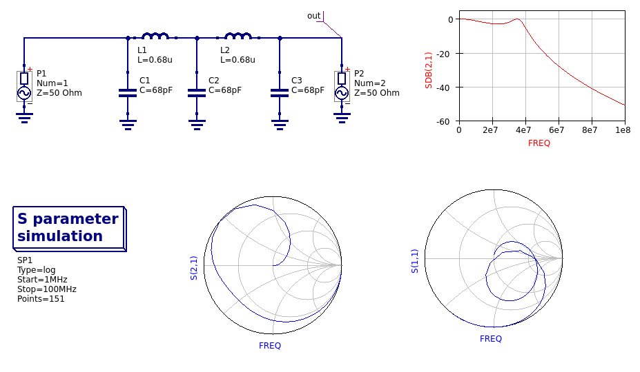

## Demo of S parameter extraction

This very embryonic demo shows off Qucs-s support for Xyce S parameter
simulation and plotting using Smith diagrams.

This example will only work in versions of Qucs-s *after* release
0.0.23 (at this time, only available by compiling the "current" branch
from source out of git).

The schematic "sparam.sch" is a simple example taken from a qucs-s
issue report calling for the implementation of Xyce S-parameter
simulation in qucs-s.

The schematic "sparams-ts1-3port.sch" tries to duplicate the circuit
in a Xyce\_Regression test case,
"Xyce\_Regression/Netlists/Output/SPARAMS/sparams-ts1-3port.cir".
As such, the S-parameters it produces are not so interesting, but it
does demonstrate multi-port S parameter generation in a schematic
capture environment that matches the way the Xyce team verifies that
multi-port S-parameter simulation actually works.

